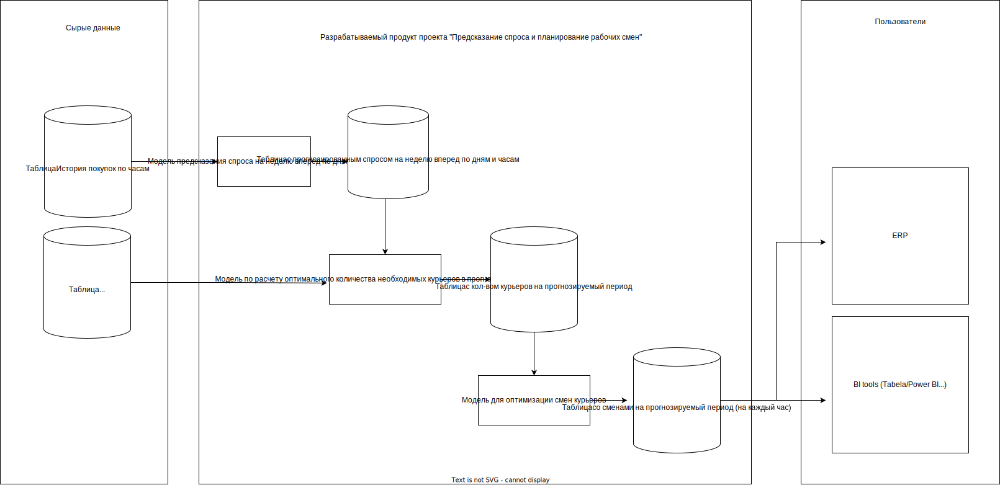

## Vision проекта "Прогноз спроса и планирование рабочих смен"


### 1. Введение

Целью данного документа является приведение к единому пониманию концепции прогнозирования и планирования рабочих смен курьеров (далее продукт) в команде. В нем кратко рассматривается возможности продукта и требования к ней.

### 2. Позиционирование

Основная цель продукта — спланировать привлечение такого количества курьеров на  неделю вперед по дням и по часам каждого дня недели, чтобы полностью компенсировать дневные колебания спроса, учитывая утренние и вечерние пики.

Заказчик: Сбермаркет.

### 3. Описание совладельцев и пользователей
- Владелец продукта: Сбермаркет.
- Пользователи: продуктовые менеджеры, которые на основе выдаваемого результата продукта принимают решения о найме курьеров.

### 4. Краткий обзор продукта			
Продукт планирует рабочие смены для курьеров по доставке продуктов и бытовых товаров на 7 дней вперед. 
Продукт на ежедневной основе «тригерит» функцию (F) для подсчета рабочих смен.
Функция F:
1. Принимает
- 1.1.  Таблицу с актуальной историей по заказам
- 1.2.  Таблицу с опозданиями 
2. Возвращает
- 2.1. Таблицу с расписанием рабочих смен

##### Cхема проекта:



### 5. Возможности продукта

Продукт обладает следующими возможностями:
- Прогноз количества заказов по часам на 7 дней вперед.
- Вычисление необходимого количества курьеров в зависимости от количества заказов в i-ый час.
- Равномерное распределение курьеров по сменам (от 4 до 8 смен).
		
### 6. Приоритизация требований
Приоритетным требованием является обеспечение качества прогнозной модели.


### 7. Требования к документации
Для описания продукта требуется следующая документация:

- Техническое задание — детальное описание требований к продукту;
- Руководство пользователя — описание порядка работы продукта;
- README — верхнеуровневое описание продукта, файлов репозитория, инструкция quick start.

### 8. Глоссарий

- ```Временной ряд``` -  собранный в разные моменты времени статистический материал о значении каких-либо параметров исследуемого процесса.
- ```Feature engineering``` - это процесс использования предметной области данных для создания признаков, которые нужны для обучения машин.  
- ```Линейная регрессия``` - статистическая модель, используемая для прогнозирования вероятности возникновения некоторого события путём его сравнения с логистической кривой. Эта регрессия выдаёт ответ в виде вероятности бинарного события (1 или 0).
- ```Градиентный бустинг``` -  универсальный алгоритм машинного обучения, основанный на использовании ансамбля деревьев решений. 
- ```Линейное программирование(LP)``` - это набор математических и вычислительных инструментов, позволяющих найти конкретное решение системы, которое соответствует максимуму или минимуму какой-либо другой линейной функции
- ```MAPE``` - средняя абсолютная процентная ошибка прогнозирования.
- ```MAE``` - средняя абсолютная ошибка прогнозирования.
